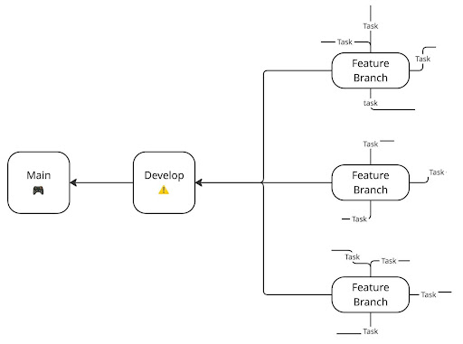

# Desarrollo y Buenas Prácticas

## Outer games Studios 🛰️

---

## Introducción

Dentro de esta guía veremos como puedes iniciar apoyando dentro del proyecto en el que estamos trabajando actualmente. 

Esta guía se enfoca específicamente en el aspecto de Git y GitHub, si tienes una duda hacerca de otra cosas puedes preguntar en el discord. 

---

## Conectarse

Usualmente vas a estar trabajando en un proyecto ya en desarrollo, ya sea open source, en una compañía, startup, etc. Dentro de Outer Games Studios es similar. 

Esto quiere decir que no tienes que crear el repositorio tu. El repositorio ya ha sido creado y tu simplemente debes de clonarlo y empezar a trabajar dentro. Después vas a pushear al repositorio remoto. 

---

## Conectarse

Entonces la primera vez que trabajes vas a tener que primero clonar el repositorio (descargar el repositorio) dentro de tu computadora. 

```bash
git clone <SSH o HTTP>
```

Ahora ya tienes el proyecto descargado, por lo que solo lo tienes que abrir dentro de Godot. Antes de iniciar a desarrollar es importante que entiendas cómo se estructuran los proyectos dentro de Outer Games Studios y algunas buenas prácticas que puedes seguir. 

---

## Estructura

Como todos los proyectos dentro de GitHub, los proyectos de Outer Games Studios tienen una rama _main_. Esta es la rama principal del proyecto, la rama que contiene todos los cambios y featuras ya autorizadas y que funcionan. 

Sin embargo, el desarrollo **no sucede dentro de main**. Todas las mecánicas del juego se desarrollan en ramas separadas, y una vez que estas funcionan se integran a una rama intermedia antes de pasar a main. 

A continuación se describe un poco mejor este método. 

---

## Estructura

Dentro de un proyecto tenemos áreas a las que llamamos _features_. Estas son partes core del videojuego y que engloban varios aspectos. Algunos ejemplos son: jugador, estructuras, enemigos, etc. Todas estas son _features_ del videojuego. 

Cada feature tiene su propia rama. Esto debido a que es más sencillo centralizar los mecánicas que están relacionadas y así poder tener un mejor control del desarrollo. Para nombrar estas ramas utilizamos el prefijo `feature/<nombre de la rama>`. Estos son algunos ejemplos de nombres:

```txt
feature/jugador
feature/estructuras
```

--- 

## Estructura

Dentro de cada _feature_ existen tareas, o _tasks_, que se deben realizar. Por ejemplo, aunque ya tenemos una rama especial para el jugador, puede que una persona esté trabajando en el movimiento de este, mientras que otras esté trabajando en los ataques y alguien más en habilidades pasivas. 

Para evitar que todos estén trabajando dentro de la misma rama, las feature branches se subdividen en ramas de tareas, dónde dentro de cada rama se alberga una funcionalidad única. Es decir, dentro de la rama de jugador podemos tener ramas como movimiento, habilidades pasivas, etc. Esencialmente estas ramas _task_ son ramas temporales que ayudan a un desarrollo más cómodo. 

---

## Estructura

Entonces una feature branch tendría esta forma:

```txt
.
└── feature/jugador/
    ├── movimiento
    ├── habilidades-pasivas
    ├── ataques-larga-distancia
    └── ataques-corta-distancia
```

Jugador es la rama principal, y todas las demás son subramas temporales. Recuerda que estas son ramas, no son diferentes carpetas del repositorio. 

---

## Estructura



Finalmente presentamos la estructura que siguen los proyectos dentro de Outer Games Studios. 

---

## Estructura


Tenemos las _feature_ branches, y todas llegan a una rama intermedia. Esta rama intermedia es en dónde probamos todas las mecánicas en conjunto para analizar si tienen conflictos. De no ser así entonces permitimos un merge a main. 

---

## Estructura

Si quieres más información sobre este método, puedes obtenerla a través de este [link](https://docs.google.com/document/d/1TmpYcx7wElXvPa_eI2UmMHCsHn9WngDuVA5-xrnXQXI/edit?tab=t.0) dónde se habla más a fondo sobre esta forma de trabajar. 

---

## Buenas Prácticas

Ahora vamos a ver algunas buenas prácticas. Se recomienda seguirlas para evitar problemas durante el desarrollo.

---

### Push

Como se explicó en esta guía, existe un método para desarrollar dentro del proyecto. Nunca intentes saltarte algún paso, ni intentes hacer otras cosas.

Nunca hagas un push directamente a main. Asegúrate de seguir la metodología establecida de _tasks_, _features_, etc. Usualmente solo vas a estar trabajando dentro de _tasks_ y _features_, por lo que no debes de preocuparte por las ramas de `development` y `main`. 

Entonces, **siempre pon atención** en dónde estas pusheando, para evitar problemas a largo plazo. Y sobre todo **nunca** hagas un push a `main`.

---

### Pull

Antes de trabajar, especialmente antes de hacer algún commit o push, es importante mantener tu repo local actualizado. Es complejo corregir errores cuando trabajas en una versión del proyecto desactualizada. 

Por eso antes de hacer un commit o un push asegurate de ejecutar el comando:

```bash
git pull --rebase origin <feature-branch-name>
```

Esta es una versión modificada del comando `pull` que vimos en guías pasadas. No te preocupes si no lo entiendes completamente, esencialmente mantiene un historial de versiones más limpio. 

---

### Commits

También es importante poner atención en los mensajes de los commits. Recuerda que el comando para crear commits es el siguiente:

```bash
git commit -m "mensaje"
```

Es importante poner mensajes descriptivos, claros, y concisos. Esto ayuda a la hora de ver que comit realiza que cambio, y es más sencillo revisar lo que se supone que debe de pasar. Algunos ejemplos de mensajes son:

```txt
Añade movimiento al jugador
Corrige cooldown de dash
Agrega sprites animados al personaje
```

---

### Gitignore

No hemos hablado de este archivo a detalle, pero un `.gitignore` es un archivo de texto que contiene los nombres de algunos archivos que no quieres que sean trackeados por Git. Esto es útil cuando quieres que Git ignore ciertos archivos, como archivos intermedios, ejecutables, etc. 

Es probable que todos los archivos que no son necesarios ya estén incluidos dentro del `.gitignore`, sin embargo es importante entender esto. 

Si, por alguna razón, necesitas un archivo especial para que Godot funcione, pero que este no es necesario para el proyecto, puedes añadirlo al `.gitignore`. Esto es útil para evitar tener archivos "basura" que no hacen nada.

---

## Recap

Estas fueron algunas recomendaciones a la hora de trabajar en el proyecto, así como una guía rápida acerca de cómo funciona el desarrollo en el grupo de estudio. Si tienes más preguntas, no dudes en contactarnos mediante el discord, estamos dispuestos a ayudarte. 

---

# ¡Gracias!
