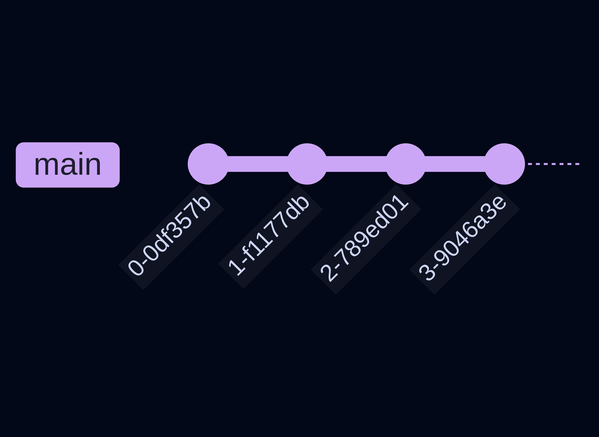
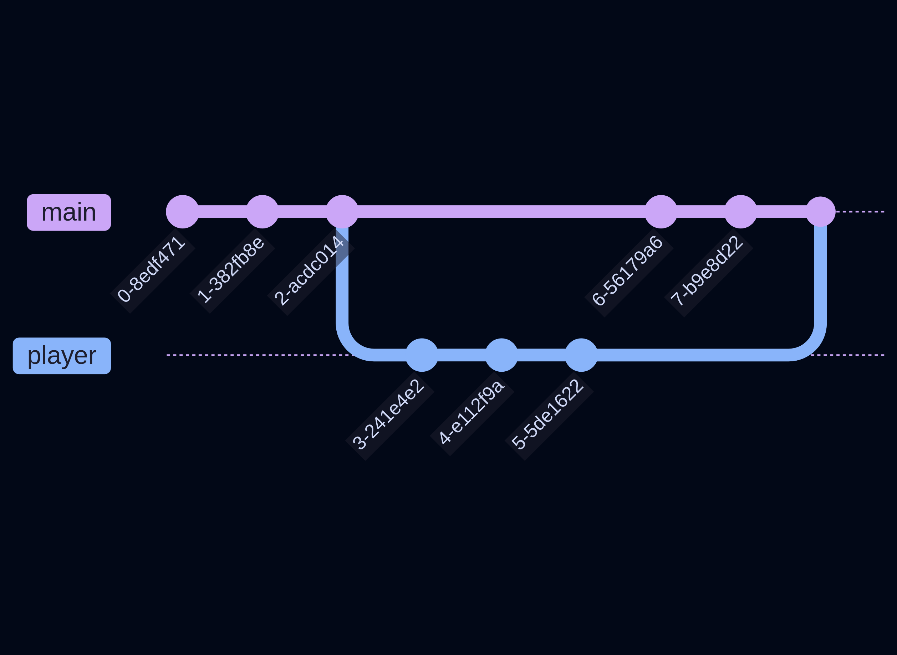

# Ramas Parte 1

## Outer games Studios 🛰️

---

## Introducción

Las ramas son un concepto fundamental en Git, y es como trabajamos colaborativamente. Hasta ahora solo hemos visto las herramientas que nos permiten trabajar a nosotros personalmente. Ahora nos enfocaremos en las herramientas que nos permiten trabajar con múltiples personas. 

Debido a la importancia de este tema y a la extensión de este, esta guía se dividirá en dos. Dentro de esta primera parte veremos una introducción a las ramas y qué son conceptualmente, y en la siguiente parte veremos exactamente cómo se crean y utilizan. 

---

## Versiones

Hasta ahora hemos dicho que Git crea screenshots de nuestro proyecto en la forma de `commits`. Sin embargo, no hemos hablado de cómo se ven estos commits, ni de realmente por qué son útiles. Ahora nos adentraremos un poco más en cómo funciona Git y por qué es tan poderoso.

---

## Historial de versiones



Cuando creamos varios commits esto es realmente lo que sucede. Tenemos una línea con varios nodos, dónde cada nodo representa un commit, o un screenshot en el tiempo. A medida que vamos creando más commits esta línea crece y se generan más nodos. 

--- 

## Historial de versiones


Cada commit tiene asociado un hash, que es esencialmente el nombre del commit. Si quieres ver esta información en tu repositorio puedes usar el comando `git log`, el cual te mostrará el hash del commit, el auutor y la fecha. 

---

## Historial de versiones


Lo interesante es que puedes volver atrás en esta historia. Si quieres visitar tu código en un estado pasado, puedes hacerlo. Para esto solo debes tener en cuenta que no debes tener archivos modificados, es decir, debes de haber realizado un commit antes de tratar de viajar a un commit pasado. 

---

## Historial de versiones


Ahora puedes usar el comando:

```bash
git checkout <commit-hash>
```

Sin introduces un hash válido te daras cuenta que todo tu proyecto cambió y se revertió a un estado previo.

---

## Historial de versiones


Para volver al estado actual solo debes utilizar el mismo comando pero con el hash del commit más reciente. 

También te puedes dar cuenta que el comando `checkout` suena mucho a _checar_, porque lo que estas haciendo es checar el estado pasado de tu proyecto.

---

## Ramas

Ahora, te habrás dado cuenta que en la imagen pasada antes de la línea de commits había un nombre `main`. Este es el nombre de la rama en la que te encuentras, la rama principal `main`. 

Esto nos introduce al concepto de ramas. Una rama es una **serie de commits**, o la línea que se genera cuando realizas varios commits seguidos. Lo poderoso de Git es que te permite crear nuevas ramas. 

---

## Ramas

Pero, ¿por qué querrías crear una nueva rama? Esto no es rápidamente obvio cuando solo tu estas trabajando en tu proyecto, pero se vuelve mas obvio cuando trabajas con multiples personas. 

Imagina que varias personas están trabajando en cosas diferentes, una persona trabaja en el movimiento del jugador, otra persona trabaja en los enemigos, y otra en los niveles. Sería muy confuso trabajar en la misma rama implementando tantas cosas. 

Imagina que un compañero se cometió un error que rompe una mecánica y necesita regresar a un commit pasado, pero tú ya habías implementado otra función después de tu compañero. Cuando tu compañero regrese a un commit pasado y continue el desarrollo ahí todo tu trabajo se habría perdido. Esto es lo que resuelven las ramas. 

---

## Ramas



En vez de trabajar en la misma rama, se puede dividir en diferentes ramas. Alguien trabaja en `main` a los enemigos mientras tú trabajas en otra rama `player` al jugador. Finalmente cuando hayas terminado puedes combinar las dos ramas para que tus cambios se reflejen dentro de la rama principal. 

---

## Ramas


De esta manera podemos garantizar colaboración con otros sin interferir en las tareas de los demás, y poder revertir cambios de ser necesario sin romper el código de nuestros compañeros. 

---

## Ramas


Podemos ver tres acciones principales en el diagrama. La parte en la que la rama sale de `main`, que es cuando creamos la rama `player`. También observamos la parte en la que se crean los commits en la nueva rama `player`. Y finalmente podemos ver cuando las ramas se combinan para continuar el desarrollo dentro de `main`. 

---

## Ramas

Estas tres acciones, **crear**, **continuar**, y **juntar** son en las que nos enfocaremos en la siguiente parte. Por ahora revisa los conceptos y asegúrate que sean claros, ya que son muy importantes para a la hora de trabajar en con Git.

---

# ¡Gracias!

## Siguiente parte: Ramas Parte 2
