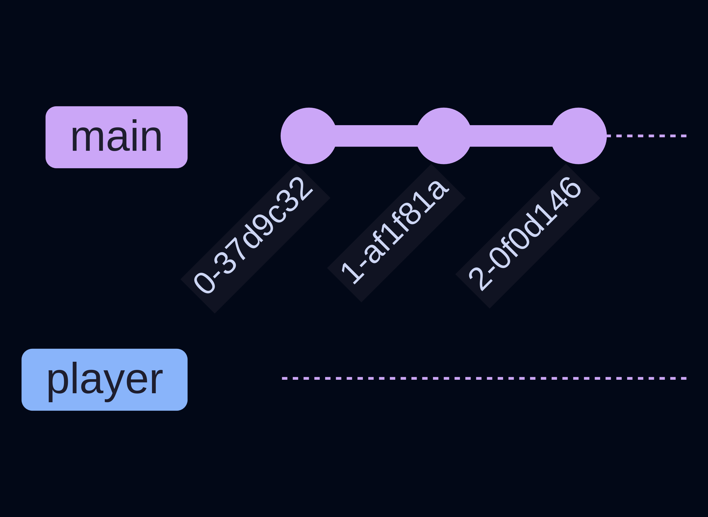
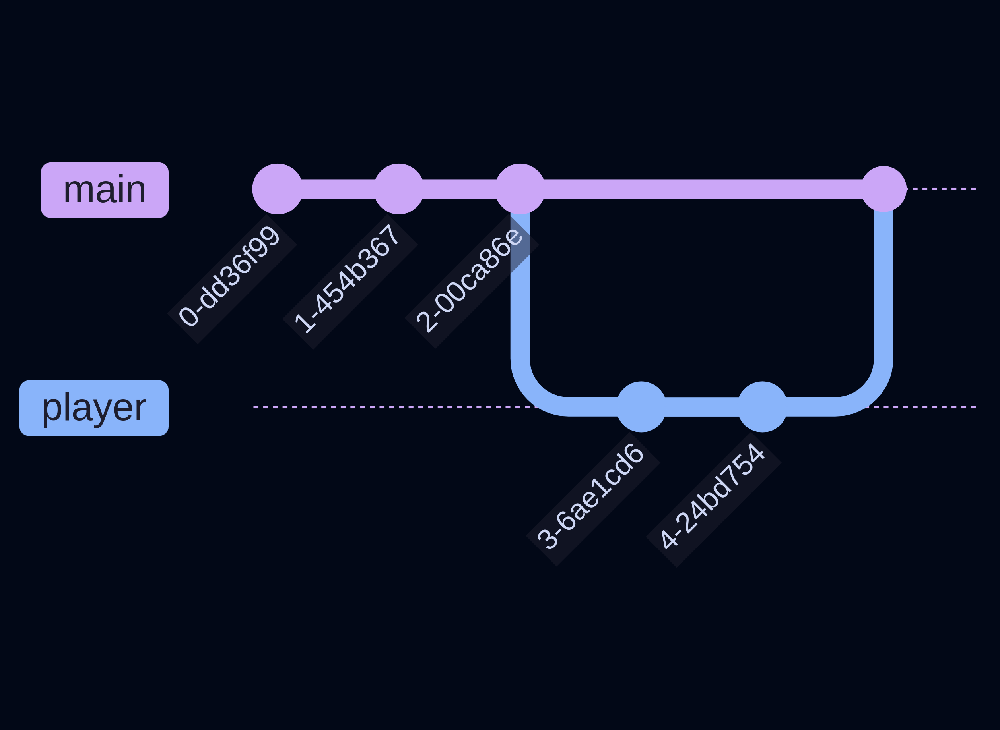

# Ramas Parte 2

## Outer games Studios 🛰️

---

## Introducción

Dentro de esta guía vamos a ver como se hacen los tres pasos que descubrimos la guía pasada, **crear**, **continuar**, y **juntar**. 

También vamos a hablar de la diferencia entre ramas locales y ramas remotas. 

---

### Crear



Antes de aprender cómo cambiar de rama, sería útil saber en qué rama nos encontramos y cuáles son las ramas que están disponibles. Para esto podemos utilizar el comando:

```bash
git branch
```

Este comando nos muestra las ramas que existen y la rama en la que actualmente nos encontramos. 

---

### Crear


Ahora si podemos pasar a crear una nueva rama. Para esto ejecutamos este mismo comando pero con un argumento:

```bash
git branch <new-branch-name>
```

Con esto podemos crear una nueva rama. 

---

### Crear


También resulta conveniente saber cambiar a otra rama. Acabamos de crear una rama, pero esto no significa que ya estemos dentro de la nueva rama, se debe de cambiar a ella. Para esto hay dos comandos que puedes utilizar:

```bash
git checkout <branch-name>
git switch <branch-name>
```

Con cualquiera de estos dos comandos puedes cambiar de rama.

---

### Crear


Finalmente, muchas veces resulta útil crear una rama y cambiar a ella luego luego. Para esto existen estos dos comandos:

```bash
git checkout -b <new-branch-name>
git switch -c <new-branch-name>
```

Estos dos comandos crean una nueva rama y automáticamente cambian a ella. 

---

##e continuar_rama.png)

Ahora que logramos cambiar de rama, podemos desarrollar dentro de esta rama. 

Esto es sencillo, simplemente sigue los mismos pasos que hemos hecho todo este tiempo: `modificar > stage/add > commit`. 

Con esto Git ya empieza a generar esta nueva rama (recuerda que una rama es una serie de commits). 

---

### Juntar 

Ahora, para juntar ramas se necesita hacer desde GitHub. Existe la forma de hacerlo desde Git, pero no es recomendable porque sólo sucede en su sistema. Antes de analizar cómo se juntan ramas tenemos que ver las diferencias entre ramas remotas y ramas locales.

---

## Remotas vs Locales

Las ramas remotas y locales se refieren a exáctamente el mismo concepto, son una serie de commits. La diferencia radica en dónde están almacenadas: dentro de mi sistema son locales, dentro del servidor de GitHub son remotas. 

Esta distinción es importante porque, al trabajar con funciones que conectan a Git con GitHub, se tiene que trabajar con las ramas de GitHub. 

---

### Push y Pull

Por ejemplo, dentro de la sección de continuar vimos como seguir con el proceso de `modificar > stage/add > commit`. Pero si recuerdas de la guía de GitHub, existe un paso después de eso. Si quieres hostear tu código en GitHub, lo que harías sería un `push`. Específicamente, 

```bash
git push origin main
```

Durante esa guía comentamos que `main` era una rama, pero no explicamos a que se refería eso. Ahora estamos listos para entender a que se refiere esa rama `main`. 

---

### Push y PUll

```bash
git push origin main
```

Las primeras tres palabras las entendemos, usamos git para hacer un push a la dirección guardada en `origin`. El `main` del final quiere decir que queremos mandar todos esos cambios a la rama `main` del repositorio remoto. Aquí es dónde la distinción entre remota y local se hace más clara. 

---

### Push y Pull

Ahora imagina que quieres hacer un pull de todo el proyecto. Entonces lo que tu haces es 

```bash
git pull origin main
```

Sin embargo, cuando ejecutas `git branch` para ver todas las ramas del proyecto te das cuenta que sólo está `main`, pero en GitHub aparece que existen más ramas. Esto es debido a que solo jalaste la rama `main` del repositorio remoto. Si quieres jalar otra rama en específico debes de ejecutar:

```bash
git pull origin <branch-name>
```

Y si quieres realizar un push a una rama que no sea `main` debes de ejecutar:

```bash
git push origin <branch-name>
```

---

### Juntar

Ahora podemos volver al tema de juntar ramas. Este es de hecho otro tema un poco complicado, pero es crucial para el desarrollo colaborativo. 

Como mencionamos antes, vamos a juntar ramas dentro de GitHub, pero primero hay que explicar un poco de los términos involucrados. 

---

### Juntar



Cuando hablamos de juntar ramas, hablamos de un **merge**. Un merge es una operación que junta dos ramas. 

Esta operación se puede realizar dentro de Git, sin embargo no es recomendable porque no existen filtros. Si el código no es correcto o necesita ciertas modificaciones, no hay manera que alguien las revise y te de retroalimentación. Es aquí donde entra GitHub.

---

### Pull Requests

Hemos hablado de que la función principal de GitHub es hostear código remoto, sin embargo no es su única función. GitHub también nos permite generar **pull requests**, que son una manera de que alguien pueda revisar nuestro código y dar retroalimentación. Una vez que el código haya sido aprobado, entonces el merge sucede automáticamente. 

--- 

### Pull Requests

Para generar un PR (pull request), se navega a la pestaña de pull requests dentro de GitHub. Dentro puedes presionar el botón de `New pull request`. Una vez dentro seleccionas de que rama a que rama quieres generar el merge (usualmente de tu rama a main), le das un título y alguna descripción para que otros puedan saber que problema resuelve tu PR. 

Con esto listo simplemente envías tu PR, y alguien con autorización (o tú mismo si eres el dueño del repo) te confirmará o te dará retroalimentación. 

Cuando tu PR sea aprobada puedes eliminar la rama local y remota, y estas listo para continuar con el desarrollo!

--- 

## Recap 

Ufff, vimos mucho esta vez. Si necesitas regresar a las slides, hazlo. Este es un tema extenso y solo se entiende con práctica. Esencialmente vimos:

- Crear ramas (`git switch -c new-branch`)
- Push y pull de ramas específicas (`git push origin new-branch`)
- Pull requests y merges dentro de GitHub

Existen más cosas que hablar, como merge conflicts, y soluciones para cuando estos problemas sucedan. Sin embargo, esta es la guía básica para Git y GitHub. Si te interesa esto puedes investigar por tu cuenta, existen muchos recursos!

---

# ¡Gracias!


